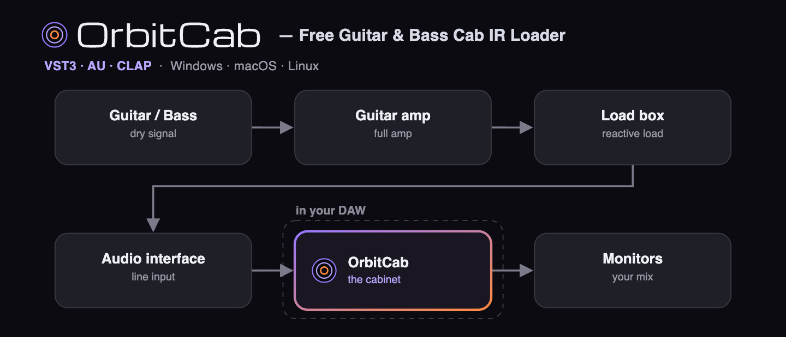

# OrbitCab



**A free, open-source amp + cab for guitar and bass — built around captured real gear.** VST3, AU, and
CLAP. Plug in a DI and build the chain like a real rig: captured preamps, a tube power stage, and
impulse-response cabinets — in your DAW.

[](LICENSE)
[](https://github.com/darwinscat/orbitcab/releases/latest)
[](https://github.com/darwinscat/orbitcab/releases)

## The signal chain

OrbitCab runs the full path from DI to speaker — or bypass any stage and bring your own:

```
DI → PREAMP (NAM capture) → TONE → POWERAMP (tube captures | tube sim) → CAB (IR) → out
```

## Preamps — captured amps up front

The preamp stage is the heart of OrbitCab. A **NAM capture** is a neural model trained from a real piece
of gear — it learns how that amp gains up, cleans up, compresses, and answers your pick attack. OrbitCab
ships captures of hardware the author owns:

- **V4KRAK** — Victory V4 **The Kraken**: modern British gain — tight low end, heavy saturation, and
  enough cut to keep fast riffs readable. **Green** (rhythm / crunch) and **Red** (high-gain lead)
  channels, captured across the full gain range (7h–17h).
- **V4SHER** — Victory V4 **The Sheriff**: classic British crunch and lead — open mids, bark, and sustain
  that doesn't slide into fizz. Two channels, full gain sweep.
- **V4COPP** — Victory V4 **The Copper**: lower-gain vintage voice — edge-of-breakup and pushed cleans.
  Two channels, full gain sweep.
- **ISA Studio Pre** — Focusrite **ISA Two**: a transformer-coupled studio preamp — clean, balanced, and
  close to invisible when you want the rest of the chain to speak. The default front end.
- **Bypass** — no preamp: tone, poweramp, and cab only.

The captures are electrical — no mic, no room, no baked-in speaker: the amp's cab-sim is off and the
cabinet comes from your IR. You get the gain structure and feel of the hardware, then choose the tone
stack, power stage, and cab yourself. Drop in your own `.nam` preamp captures too.

## Poweramp — tube captures or a tube sim

The power stage has two engines behind one switch:

- **Captures** — NAM captures of real tube power amps: **6L6, EL34, EL84, KT88**.
- **Simulator** — a tube power amp modeled from the ground up: choose the tube type, push-pull or
  single-ended, and dial sag and bias bloom.

Reach for the captures when you want the behaviour of specific tube stages; reach for the simulator to
shape the power section directly — tighter, softer, cleaner, more collapsed, or more pushed. Both are
level-matched, so you A/B by tone, not by volume.

## Cabinets — the IR loader

The speaker at the end of the chain, and where OrbitCab started:

- Two IR slots with A↔B blend
- Per-slot HPF, LPF, trim, head alignment, phase, and dry/wet
- File/folder browser and drag-and-drop loading; bundled cabinet packs
- Every IR normalized on load, so swapping a cab changes tone, not loudness

## Tone & workflow

- A voiced tone stack (bass / mid / treble / presence + HPF/LPF) between preamp and poweramp, with a
  live response curve
- A/B/C/D snapshots, undo/redo, auto-level, live spectrum
- Presets that export/import with the IR embedded
- Session state is versioned, so updates don't break old projects

## Install

Grab the latest build from the
[Releases](https://github.com/darwinscat/orbitcab/releases/latest) page:

- **macOS** — open `OrbitCab-<ver>-macOS.pkg` (signed + notarized — installs cleanly, no
  Gatekeeper prompt). Or take the `.zip` and copy the bundles into
  `~/Library/Audio/Plug-Ins/` (`VST3/`, `Components/`, `CLAP/`).
- **Windows** — run `OrbitCab-<ver>-Windows-Setup.exe` (x64). It isn't code-signed yet, so
  SmartScreen warns — click **More info → Run anyway**. On Arm (Snapdragon) machines use
  `OrbitCab-<ver>-Windows-arm64.zip` and copy the plugins into your VST3 / CLAP folders.
- **Linux** — extract `OrbitCab-<ver>-Linux-<arch>.tar.gz` and copy `OrbitCab.vst3` /
  `OrbitCab.clap` into `~/.vst3` / `~/.clap`.

Then rescan in your DAW. A **standalone** app is included for use without a DAW.

Verify a download against [`SHA256SUMS`](https://github.com/darwinscat/orbitcab/releases/latest)
(attached to each release): `shasum -a 256 -c SHA256SUMS` (macOS) or `sha256sum -c SHA256SUMS` (Linux).

| Format | Platforms |
|--------|-----------|
| VST3   | Windows, macOS, Linux |
| CLAP   | Windows, macOS, Linux |
| AU     | macOS |
| Standalone | Windows, macOS, Linux |
| AAX (Pro Tools) | Not supported |

macOS builds are universal (Apple Silicon + Intel); Windows ships x64 and arm64; Linux ships x86_64 and arm64.

> No AAX/Pro Tools build: the AAX SDK needs Avid approval and PACE/iLok signing, which
> can't be shipped with a free, open-source plugin.

## Usage

Feed OrbitCab a DI (or a clean, low-gain signal) and dial the chain: pick a preamp — or **Bypass** —
shape the tone, choose a power stage, and load a cabinet. Already have an amp sim or amp-head capture you
love? Bypass the preamp and use OrbitCab as tone + cabinet. A standalone app is included for playing
without a DAW.

## Build from source

```bash
cmake -B build -DCMAKE_BUILD_TYPE=Release
cmake --build build --config Release
```

The first configure fetches and builds JUCE (pinned). Artefacts are written to
`build/OrbitCab_artefacts/`. See [docs/BUILD.md](docs/BUILD.md) for validation and packaging.

## License

[AGPL-3.0-or-later](LICENSE). You may use, modify, and redistribute OrbitCab; if you
distribute it, you must make the corresponding source available under the same license.
Third-party notices are in [THIRD_PARTY_NOTICES.md](THIRD_PARTY_NOTICES.md). The "OrbitCab"
and "Darwin's Cat" names and logos are trademarks, not covered by the code license.

## Contributing

Bug reports and pull requests are welcome — see [CONTRIBUTING.md](CONTRIBUTING.md).

---

OrbitCab is part of the Felitronics line by [Darwin's Cat](https://darwinscat.com/orbitcab).
