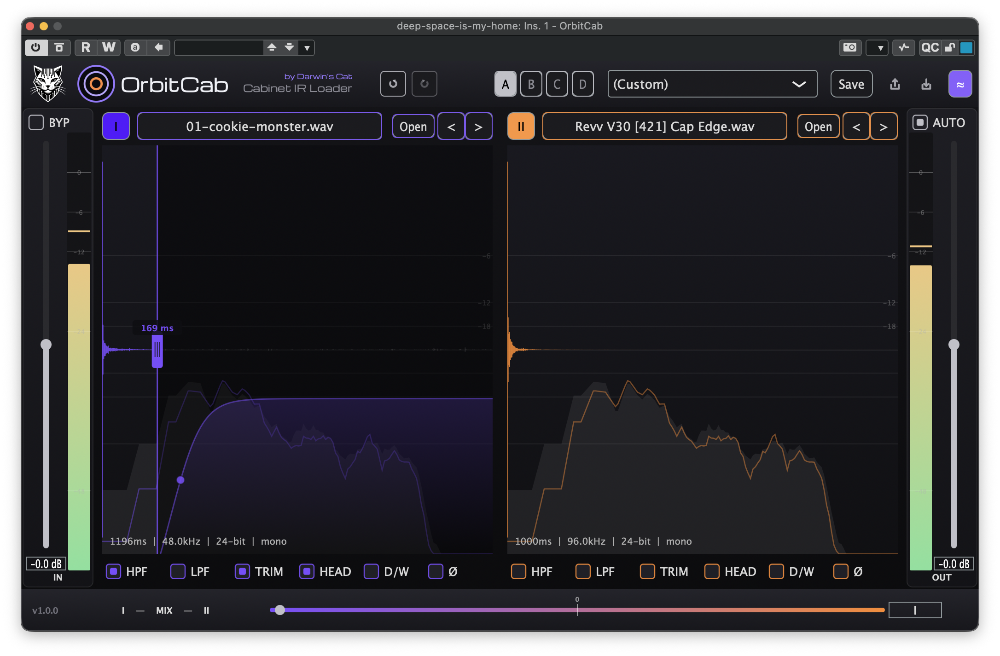

# OrbitCab

Free, open-source impulse-response (IR) cabinet loader for electric guitar and bass.
Load a cabinet IR and hear your DI through it — in any DAW.



## Features

- Two IR slots with A↔B blend
- Per-slot HPF, LPF, trim, head alignment, phase, and dry/wet
- A/B/C/D snapshots, undo/redo, auto-level, live spectrum
- File/folder browser and drag-and-drop loading; bundled cabinet packs
- Presets that export/import with the IR embedded
- Session state is versioned, so updates don't break old projects

## Install

Download the latest build for Windows, macOS, or Linux from the
[Releases](https://github.com/darwinscat/orbitcab/releases/latest) page, copy the plugin
into your system plugin folder, and rescan in your DAW. A standalone app is included for
use without a DAW.

| Format | Platforms |
|--------|-----------|
| VST3   | Windows, macOS, Linux |
| CLAP   | Windows, macOS, Linux |
| AU     | macOS |
| Standalone | Windows, macOS, Linux |
| AAX (Pro Tools) | Not supported |

macOS builds are universal (Apple Silicon + Intel); Windows ships x64 and arm64; Linux ships x86_64 and arm64.

> No AAX/Pro Tools build: the AAX SDK needs Avid approval and PACE/iLok signing, which
> can't be shipped with a free, open-source plugin.

## Usage

OrbitCab is a cabinet, not an amp. Place it after your amp sim, preamp, or amp-head
capture (e.g. Neural Amp Modeler): the amp shapes the gain, OrbitCab supplies the speaker
cabinet. Load an IR into a slot, optionally load a second, and blend the two.

## Build from source

```bash
cmake -B build -DCMAKE_BUILD_TYPE=Release
cmake --build build --config Release
```

The first configure fetches and builds JUCE (pinned). Artefacts are written to
`build/OrbitCab_artefacts/`. See [docs/BUILD.md](docs/BUILD.md) for validation and packaging.

## License

[AGPL-3.0-or-later](LICENSE). You may use, modify, and redistribute OrbitCab; if you
distribute it, you must make the corresponding source available under the same license.
Third-party notices are in [THIRD_PARTY_NOTICES.md](THIRD_PARTY_NOTICES.md). The "OrbitCab"
and "Darwin's Cat" names and logos are trademarks, not covered by the code license.

## Contributing

Bug reports and pull requests are welcome — see [CONTRIBUTING.md](CONTRIBUTING.md).

---

OrbitCab is part of the Felitronics line by [Darwin's Cat](https://darwinscat.com/orbitcab).
